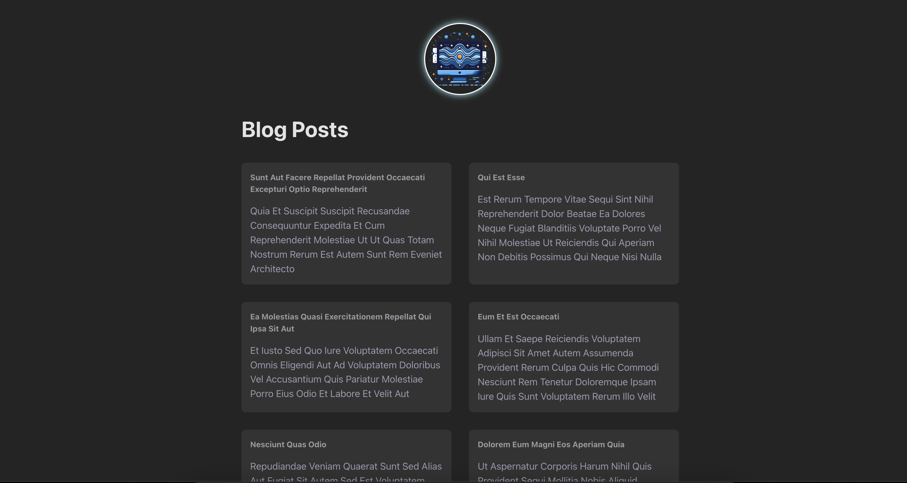
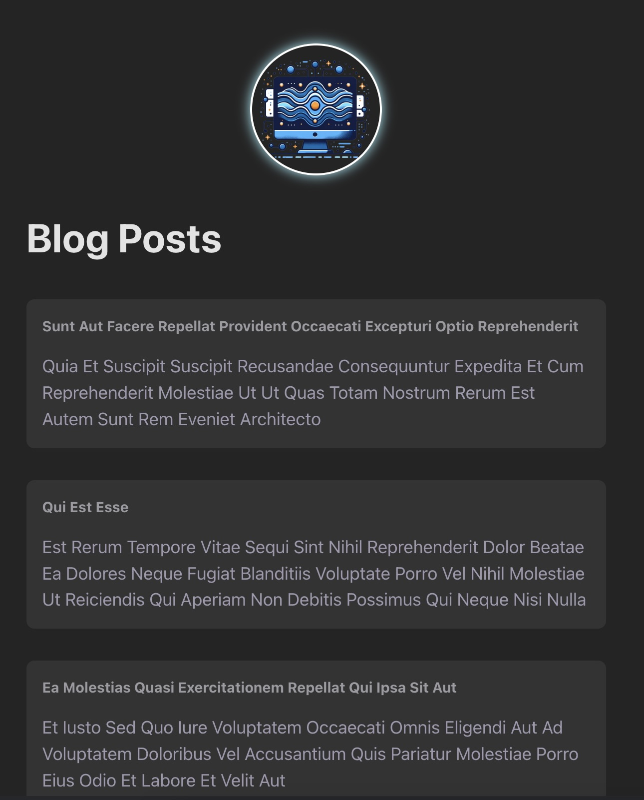

# React-BlogPost

# Blog Post Fetching React App

This is a React application built with Vite that fetches blog post data from an API and displays it in a user-friendly interface.

## Table of Contents

-   [Features](#features)
-   [Demo](#demo)
-   [Installation](#installation)
-   [Usage](#usage)
-   [API Reference](#api-reference)
-   [Contributing](#contributing)
-   [License](#license)

## Features

-   Fetches blog post data from a REST API
-   Displays blog posts in a clean, responsive layout
-   Detailed view for each blog post
-   Search functionality to find specific posts
-   Pagination support

## Installation

1. Clone the repository:
    ```bash
    git clone https://github.com/yourusername/blog-post-fetching-react-app.git
    ```
2. Navigate to the project directory:
    ```bash
    cd blog-post-fetching-react-app
    ```
3. Install the dependencies:
    ```bash
    npm install
    ```

## Usage

1. Start the development server:
    ```bash
    npm run dev
    ```
2. Open your browser and go to `http://localhost:5173` to see the app in action.

## API Reference

The app fetches blog posts from a REST API - jsonplaceholder. You can use any API that returns blog post data in JSON format.





```

```
